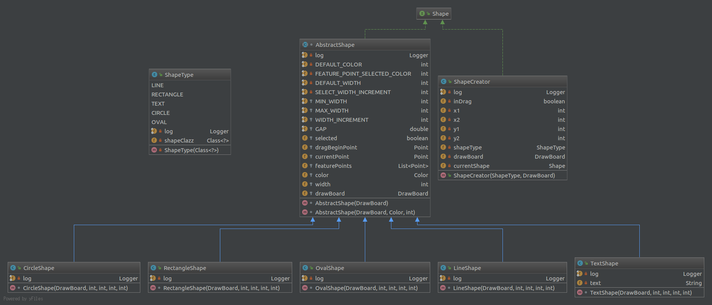

# MiniCAD


## Build

这是一个使用maven构建的项目，关于maven使用可以参考[maven guides](https://maven.apache.org/guides/)

## 设计

### UI

UI三方依赖: SWT

- 控制面板，控制当前状态和绘制图形
    - 图形种类包括：Line, Rectangle, Text, Circle, Oval, 在
    [ShapeType.java](./src/main/java/com/baislsl/minicad/shape/ShapeType.java)中定义
    - 模式包括：CREATE, DELETE, MODIFY, 在[Mode.java](./src/main/java/com/baislsl/minicad/util/Mode.java)中定义
    
- 绘画面板，绘制各种图形， 该部分主体为一个canvas视图，接受控制面板的信号，监听鼠标事件
- 菜单，导入导出文件和退出程序

### 主面板
绘画面板开始一直监听鼠标事件，当鼠标点击后，如果为CREATE模式，创建并转移鼠标监听给一个新的ShapeCreator对象，如果为DELETE或
MODIFY模式，获取鼠标的坐标，然后逐个判断该坐标对应的Shape对象，将监听器转移给对应的对象。

具体实现如下：
```java
public class DrawPanel extends Composite implements MessageReceiver, DrawBoard {
    private MouseAdapter defaultMouseAdapter = new MouseAdapter() {
        @Override
        public void mouseDown(MouseEvent e) {
            log.info("mouseDown at ({}, {})", e.x, e.y);
            if (currentMode == Mode.CREATE) {
                ShapeCreator creator = new ShapeCreator(currentShapeType, DrawPanel.this);
                creator.install(DrawPanel.this);
            } else if (currentMode == Mode.DELETE) {    // DELETE
                Shape shape = fetchShape(e.x, e.y);
                if (shape == null) return;
                shapeList.remove(shape);
                redraw();
            } else {    // MODIFY
                Shape shape = fetchShape(e.x, e.y);
                if(shape != null)
                    shape.install(DrawPanel.this);
            }
        }
    };
    private Shape fetchShape(int x, int y) {
        for (Shape shape : shapeList) {
            if (!(shape instanceof TextShape) && shape.intersects(new Point(x, y)))
                return shape;
        }
        for (Shape shape : shapeList) {
            if ((shape instanceof TextShape) && shape.intersects(new Point(x, y)))
                return shape;
        }
        return null;
    }
        
}
```
注意在fetchShape方法中，判断坐标位置对应的图形时其他图形的判断是优先于文字的，这是因为对于直线，长方形，圆等规则图形
都能比较精确地找到点是否在图形附近，但对于文字只能直接根据点是否落在包围文字的框上去判断

### 创建新的图形

如果为CREATE模式，点击后ShapeCreator创建并获得鼠标监听，当鼠标松开后，
ShapeCreator根据鼠标点击按下的位置和松开的位置这两个点，
来确定创建图形的位置，当创建好后，ShapeCreator重新把鼠标监听转移给DrawBoard。

代码实现如下：
```java
public class ShapeCreator implements Shape {
    @Override
    public void mouseUp(MouseEvent e) {
        log.info("mouseUp at ({}, {})", e.x, e.y);
        inDrag = false;
        x2 = e.x;
        y2 = e.y;

        if (currentShape != null) drawBoard.removeShape(currentShape);
        if ((currentShape = generateShape()) != null) {
            drawBoard.addShape(currentShape);
            drawBoard.redraw();
        }

        uninstall(drawBoard);
    }
    
    private Shape generateShape() {
        if (x1 == x2 && y1 == y2) {
            return null;
        } else {
            return shapeType.newShapeInstance(drawBoard, x1, y1, x2, y2);
        }
    }
}
```


### 图形结构

Line，Rectangle等图形均定义在Shape包下，设置图如下



所有图形均实现了Shape接口，Shape接口如下
```java
public interface Shape extends JSONDumpable, MouseListener, MouseMoveListener {

    /**
     * 执行图形绘制
     * @param gc GC
     */
    void render(GC gc);

    /**
     * 得到一个包围住该图形的长方形
     * @return Rectangle
     */
    Rectangle getBounds();

    /**
     * 定义图形颜色
     * @param color 颜色
     */
    void setColor(Color color);

    /**
     * 定义线条宽度
     * @param width 宽度
     */
    void setWidth(int width);


    /**
     * 判断某个点是否在图形上
     * @param p 点
     * @return true if intersect, else false
     */
    default boolean intersects(Point p) {
        return getBounds().contains(p);
    }

    /**
     * 将监听器安装到DrawBoard上
     * @param c DrawBoard
     */
    default void install(DrawBoard c) {
        c.getCanvas().addMouseListener(this);
        c.getCanvas().addMouseMoveListener(this);
    }

    /**
     * 卸载监听器
     * @param c DrawBoard
     */
    default void uninstall(DrawBoard c){
        c.getCanvas().removeMouseListener(this);
        c.getCanvas().removeMouseMoveListener(this);
        c.setUpMouseListener();
    }
}
```

### 文件保存和导入

使用com.googlecode.json-simple库进行json文件的读写，
每个形状保存颜色的RGB值，宽度，和特定的点进行保存，文字图案额外保存下文字信息。
每个Shape图形都实现JSONDumpable接口

```java
public interface JSONDumpable {

    JSONObject toJSONObject();

    void loadFormJSONObject(JSONObject object, DrawBoard drawBoard);
}
```

#### 关于特征点选取

1. 直线，选取两个端点
2. 长方形， 选取4个顶点
3. 椭圆或圆，x方向的两个极值点和y方向两个极值点
4. 文字，包围文字的边框的左上顶点和右下顶点

